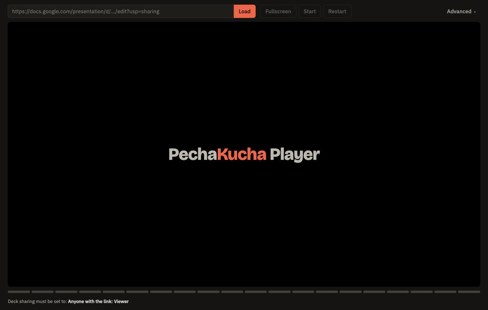
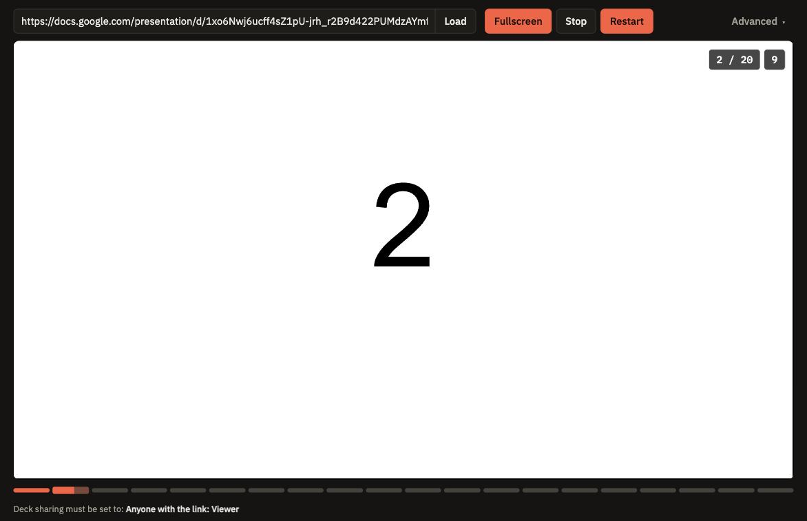
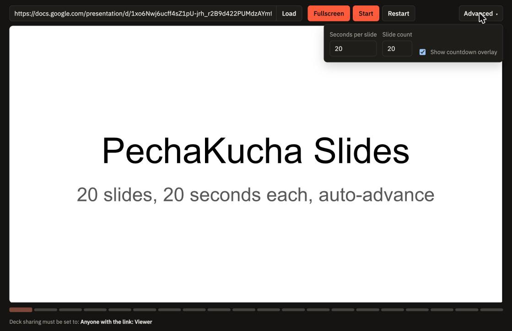

# PechaKucha Player

A simple Google Slides player for timed presentations. The default is **20 slides × 20 seconds**: 6 minutes, 40 seconds total. Includes a countdown, slide counter, progress timeline, and fullscreen view.

**[Open the player](https://theantonius.github.io/pechakucha-player/)**

## Quick start

1. In Google Slides, set sharing to **Anyone with the link: Viewer** and copy the link.
2. Paste the link into the player and select **Load**. The deck loads without starting.
3. Select **Start**, or **Fullscreen** to enter fullscreen and start playback.

Standard Google Slides links and published presentation links are supported.

## Controls

- **Start / Stop:** Start playback or hold on the current timed slide. Starting again gives that slide its full countdown; it does not resume mid-countdown. The deck reloads each time you start or stop, so it briefly flickers.
- **Restart:** Return to the first slide and reset the timer. Select **Start** to begin again.
- **Fullscreen:** Show the deck and countdown in fullscreen and start playback. Leaving fullscreen stops playback. Not available on iPhone, where the button is hidden.
- **Space:** Toggle Start / Stop anywhere on the page, including in fullscreen. It doesn't work while you're typing in a field.

## Advanced

- **Seconds per slide:** 3–120 seconds; default 20.
- **Slide count:** 1–100 slides; default 20. The show stops on this slide. Enter it manually; the player can't read how many slides your deck has.
- **Show countdown overlay:** Show or hide the slide counter and remaining seconds.

Changing the duration or slide count resets the presentation. The slide count controls the timer, the timeline, and where the deck stops. If your deck has fewer slides than the slide count, Google Slides stops at the deck's last slide while the timer keeps running.

## Timing and sharing notes

Google Slides advances the deck. The player runs a separate timer, starting when the embedded deck finishes loading after you select **Start**. The countdown may drift a second or two from Google's slide changes. Select **Restart**, then **Start**, to resync from the beginning.

The slide counter estimates your position from elapsed time. Google's toolbar is hidden and clicks on the deck are blocked, so the player's buttons are the only controls. This keeps the counter in sync with the deck.

If the deck is blank or asks you to sign in, check that sharing is set to **Anyone with the link: Viewer**. Only use decks intended for access by anyone with the link.

After loading a deck, copy the player URL from your browser to share the same setup. It includes the deck link and any non-default duration or slide count. If you change those settings, select **Load** again before copying the URL. Shared links load paused.

## Run locally or host your own

Download `index.html` and open it in a browser. No installation or build step is required. An internet connection is needed to load Google Slides and the Google Fonts used by the page.

The live player is hosted on **GitHub Pages**. To host your own copy, put `index.html` at the root of a static website. For GitHub Pages, publish the branch and folder containing that file from **Settings → Pages**.

## Technical notes

Everything lives in `index.html`: markup, CSS, and plain JavaScript. There is no backend, package manager, or build tooling.

Google Slides runs in an iframe. The countdown uses `performance.now()` and `requestAnimationFrame()` and cannot read the deck's actual slide position. The page follows the browser's light or dark color preference.

Player URLs support `deck` (Google Slides URL), `sec` (seconds per slide), and `n` (slide count). Loading a deck updates these parameters in the address bar.

## License

Released under the [MIT License](LICENSE). You're free to use, copy, modify, and share this project, including for commercial use, as long as the copyright notice is kept.
